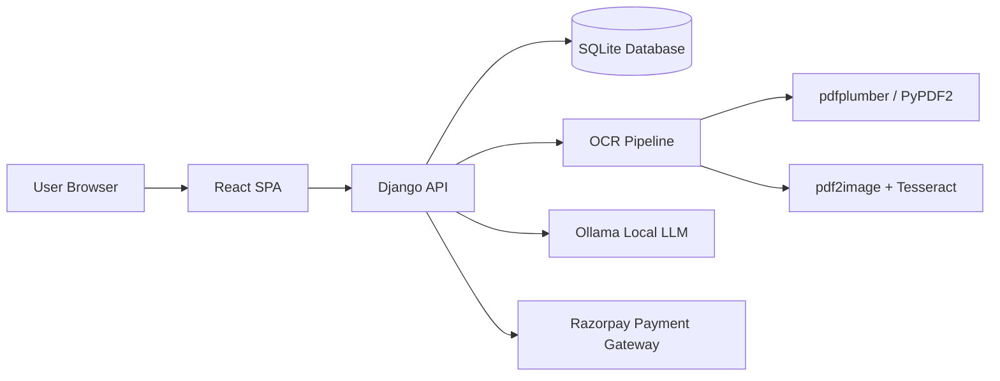
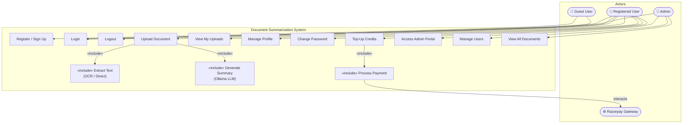
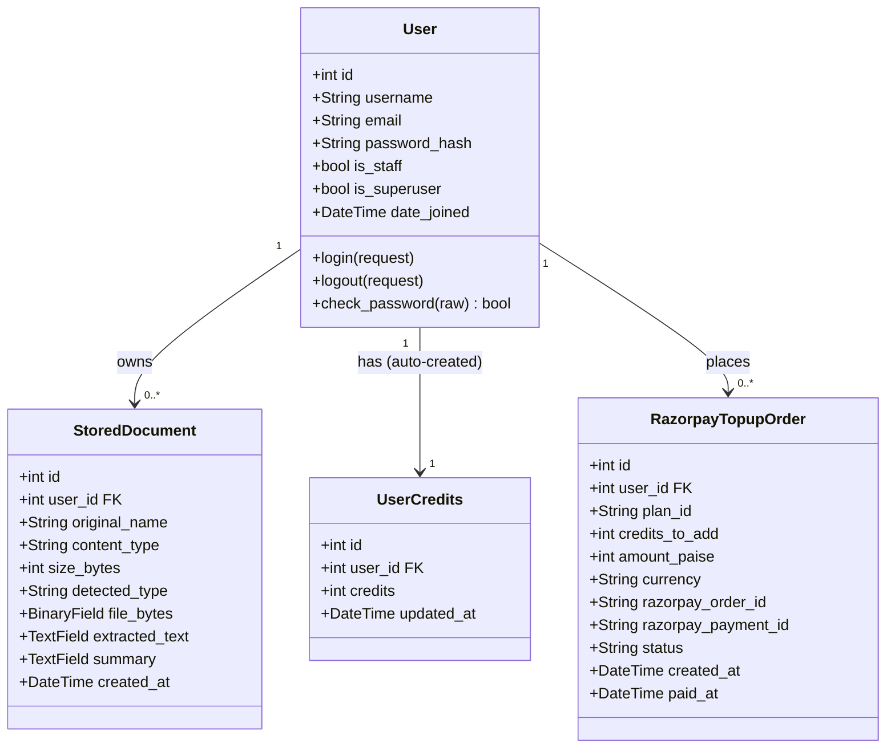
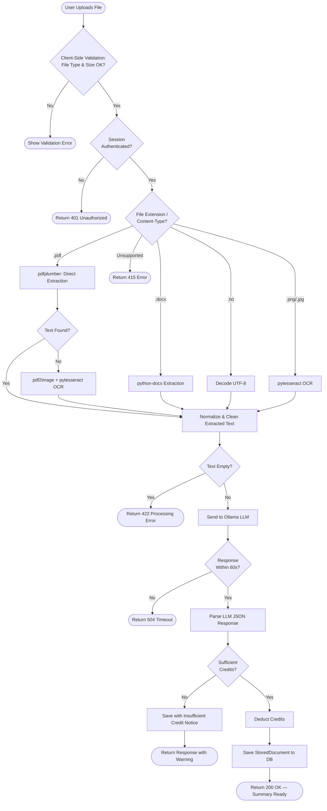
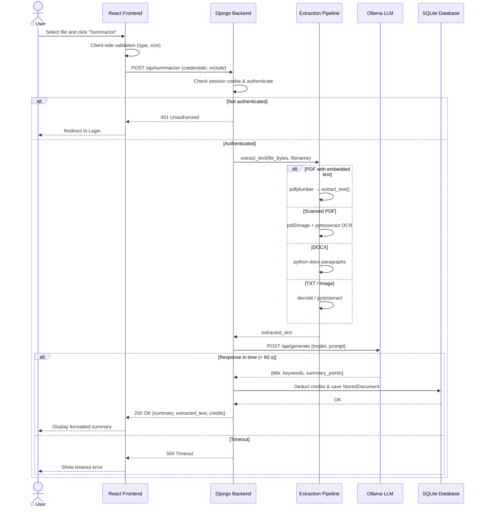

# Software Development Project Report

## On

# Synopsis: AI-Powered Document Summarization System

Prepared By:

| Sr. No. | Name | ID |
| --- | --- | --- |
| 1 | [Student Name 1] | [Enrollment ID 1] |
| 2 | [Student Name 2] | [Enrollment ID 2] |
| 3 | [Student Name 3] | [Enrollment ID 3] |

B.Tech. Computer Engineering, Semester VI  
Subject: System Design Practice  
Faculty of Technology  
Department of Computer Engineering  
[University Name]  
Academic Year: 2025-26

---

## Certificate

This is to certify that the project entitled **"Synopsis: AI-Powered Document Summarization System"** has been successfully completed by the above students in partial fulfillment of the requirements for the degree of Bachelor of Technology in Computer Engineering during the academic year 2025-26.

The work presented in this report has been carried out under academic supervision and has been found satisfactory in terms of design thinking, implementation quality, testing, and documentation standards.

Date: ____________

Project Guide: ____________________  
Head of Department: ____________________

---

## Acknowledgement

We express our sincere gratitude to our faculty guide, department mentors, and the Department of Computer Engineering for their valuable guidance throughout the development of this project. Their technical insights, review feedback, and continuous support helped us transform the initial idea into a structured software product.

We also thank our classmates and peers who provided practical suggestions during testing, usability evaluation, and system validation. Their feedback played an important role in refining the application workflow, improving the user interface, and strengthening the final implementation.

---

## Table of Contents

1. Introduction  
1.1 Project Overview  
1.2 Problem Statement  
1.3 Objectives  
1.4 Scope of the Project  
1.5 Tools, Technology and Platform Used  
2. Software Requirement Specification  
2.1 Product Scope  
2.2 Types of Users  
2.3 Functional Requirements  
2.4 Non-Functional Requirements  
3. System Design  
3.1 Architecture Overview  
3.2 Use Case Diagram  
3.3 Data Model  
3.4 Activity Flow  
3.5 Sequence Flow  
4. Implementation Details  
4.1 Frontend Implementation  
4.2 Backend Implementation  
4.3 OCR and Document Processing Pipeline  
4.4 Summarization Engine  
4.5 Authentication and Security  
4.6 Credits and Payment Module  
5. Testing  
5.1 Testing Strategy  
5.2 Test Cases  
5.3 Observations  
6. Key Screens and Output Discussion  
7. Conclusion  
8. Limitations and Future Enhancements  
9. Bibliography

---

## Abstract

The **Document Summarization System (Synopsis)** is an industry-oriented full-stack web application designed to reduce the manual effort required to read, extract, and summarize large documents. The system accepts multiple file formats including PDF, TXT, DOCX, PNG, and JPG, extracts text using direct parsers and OCR when required, and generates structured summaries using a local Large Language Model served through Ollama.

Unlike basic summarization demos, the system has been designed as a usable product with user authentication, protected routes, upload history, profile management, password security features, a credit-based usage model, and Razorpay-based top-up support. The application follows a separation-of-concerns architecture with a Django backend, React frontend, SQLite persistence layer, and local AI processing stack.

The major contribution of this project lies in combining document ingestion, OCR fallback, summary generation, user-level data management, and billing support into a single practical platform. The system demonstrates how AI-assisted summarization can be transformed from a standalone algorithm into a complete software product suitable for academic, professional, and administrative use cases.

---

## 1. Introduction

### 1.1 Project Overview

In academic and professional environments, users often need to work with lengthy reports, scanned documents, contracts, project files, and notes. Reading entire files manually is time-consuming, especially when the user only needs the major points, extracted content, or a short understanding of the document. This project addresses that problem by providing a document summarization platform that automates text extraction and produces a concise, structured summary.

The system is named **Synopsis** because it focuses on converting lengthy and complex document content into a clear and digestible overview. The application supports both text-based and image-based documents, making it more useful than a system restricted only to plain text PDFs.

### 1.2 Problem Statement

Manual review of large documents is inefficient, repetitive, and error-prone. Existing summarization tools often suffer from one or more of the following limitations:

- They support only a limited set of input formats.
- They fail on scanned PDFs and image-based documents.
- They rely entirely on third-party cloud APIs.
- They provide no user-specific history, access control, or billing structure.
- They do not preserve the workflow expectations of a production-grade software product.

The problem addressed in this project is to design and implement a reliable document summarization platform that can ingest real user files, extract text intelligently, generate structured summaries, and manage usage in a secure, user-friendly way.

### 1.3 Objectives

The primary objectives of the project are:

- To build a full-stack web application for document summarization.
- To support multiple document types such as PDF, TXT, DOCX, PNG, JPG, and JPEG.
- To extract text using both parser-based and OCR-based approaches.
- To generate structured summaries through a local LLM pipeline.
- To maintain user-wise upload history and summary storage.
- To provide secure session-based authentication and account management.
- To implement a credit-based usage system and payment top-up workflow.
- To make the system suitable for academic demonstration and practical deployment.

### 1.4 Scope of the Project

The scope of the system includes document upload, text extraction, text normalization, summarization, result presentation, summary storage, user authentication, payment-based credits, and upload history management. The project is intended for educational, administrative, and productivity use cases where concise understanding of lengthy files is needed.

The current implementation is optimized for local deployment and development environments. It is not positioned as a globally scaled SaaS platform in its present form, but the design choices are sufficiently modular to support future extension toward cloud deployment.

### 1.5 Tools, Technology and Platform Used

#### Backend

| Category | Technology |
| --- | --- |
| Programming Language | Python 3.x |
| Web Framework | Django 4.2 |
| Authentication | Django session authentication |
| Database | SQLite |
| OCR/Text Extraction | pdfplumber, PyPDF2, pdf2image, pytesseract, Pillow |
| Document Parsing | python-docx |
| AI Summarization | Ollama local LLM |
| Payment Integration | Razorpay |

#### Frontend

| Category | Technology |
| --- | --- |
| Programming Language | JavaScript (ES6+) |
| UI Framework | React 19 |
| Routing | React Router |
| Build Tool | Vite |
| Styling | CSS |

#### Development Tools

| Category | Tool |
| --- | --- |
| IDE | Visual Studio Code |
| Version Control | Git and GitHub |
| API Testing | Browser fetch / manual API testing |
| Local AI Runtime | Ollama |

---

## 2. Software Requirement Specification

### 2.1 Product Scope

The product allows authenticated users to upload supported documents, extract readable text, generate structured summaries, view previous uploads, manage profile settings, and purchase credits for further usage. The backend coordinates the document pipeline while the frontend provides a modern protected user experience.

### 2.2 Types of Users

| User Type | Description |
| --- | --- |
| Guest User | Can access public pages such as home, about, terms, privacy, login, and signup |
| Registered User | Can log in, upload documents, generate summaries, view uploads, manage profile, and use billing |
| Admin User | Can access Django admin panel and monitor backend database records |

### 2.3 Functional Requirements

| ID | Requirement |
| --- | --- |
| FR-1 | User should be able to sign up with name, mobile, email, and password |
| FR-2 | User should be able to log in using email/mobile and password |
| FR-3 | User should be able to upload supported document types |
| FR-4 | System should extract text from PDFs, TXT, DOCX, and images |
| FR-5 | System should apply OCR when direct extraction is insufficient |
| FR-6 | System should generate a structured summary from extracted text |
| FR-7 | System should store uploaded document, extracted text, and summary |
| FR-8 | User should be able to view upload history and download stored files |
| FR-9 | System should maintain user credits and deduct them based on usage |
| FR-10 | User should be able to top up credits using Razorpay |
| FR-11 | User should be able to manage profile, password, and security settings |
| FR-12 | Admin should be able to manage records through Django admin |

### 2.4 Non-Functional Requirements

| Category | Requirement |
| --- | --- |
| Performance | System should process typical documents within acceptable local execution time |
| Reliability | The application should handle unsupported files and errors gracefully |
| Security | Protected routes and session-based authentication must restrict unauthorized access |
| Maintainability | Code should remain modular across frontend, backend, OCR, and summarization components |
| Usability | Interface should be easy to use for non-technical users |
| Scalability | Architecture should support migration to stronger databases and deployment environments later |

---

## 3. System Design

### 3.1 Architecture Overview

The project follows a layered architecture. The React frontend handles user interaction and route protection. Requests are forwarded to the Django backend, which manages authentication, document processing, credit accounting, and persistent storage. For summarization, the backend communicates with a locally running Ollama model. For scanned documents, OCR fallback is performed before summarization.

### 3.2 Use Case Diagram

The system has three primary actors: **Guest User** (pre-login), **Registered User** (post-login), and **Admin** (Django superuser). A fourth system actor, **Razorpay Gateway**, participates in the payment flow.

Key use cases and their relationships:

| Use Case | Actor | Includes |
| --- | --- | --- |
| Register / Sign Up | Guest User | — |
| Login | Guest & Registered User | — |
| Upload Document | Registered User | «include» Extract Text, «include» Generate Summary |
| Top-Up Credits | Registered User | «include» Process Payment (Razorpay) |
| View My Uploads | Registered User | — |
| Manage Profile / Security | Registered User | — |
| Access Admin Portal | Admin | Manage Users, View All Documents |

> **Full detailed Use Case Diagram** with all edge cases is in `docs/UML_DIAGRAMS.md` → Section 1.

### 3.3 Data Model

The core persistent entities identified from the implementation are summarized below.

| Entity | Key Fields | Purpose |
| --- | --- | --- |
| User | username, email, password | Stores authentication identity |
| StoredDocument | original_name, content_type, size_bytes, detected_type, file_bytes, extracted_text, summary | Stores uploaded file and summarization results |
| UserCredits | user, credits, updated_at | Stores available usage credits |
| RazorpayTopupOrder | plan_id, credits_to_add, amount_paise, razorpay_order_id, status | Tracks payment and top-up lifecycle |

> **Full detailed Class Diagram** with service classes (`SummarizationPipeline`, `OCRPipeline`, `RazorpayPaymentService`) is in `docs/UML_DIAGRAMS.md` → Section 2.

### 3.4 Activity Flow

The activity diagram below shows the complete path a document takes from upload to summarization, including all decision points for file type detection, OCR fallback, LLM processing, and credit deduction.

> **Full detailed Activity Diagram** including the Payment Top-Up flow is in `docs/UML_DIAGRAMS.md` → Section 3.

### 3.5 Sequence Flow

The sequence diagram below shows the primary summarization flow with all participant interactions, including authentication checks, extraction pipeline, Ollama call, timeout handling, and database persistence.

> **Full detailed Sequence Diagrams** (including Registration/Login and Payment flows) are in `docs/UML_DIAGRAMS.md` → Section 4.

---

## 4. Implementation Details

### 4.1 Frontend Implementation

The frontend is implemented using React and Vite. Routing is managed through React Router. Protected sections such as upload, profile, billing, settings, security, and upload history are guarded through a dedicated authentication wrapper. The frontend provides a modern user flow with separate public and authenticated screens.

Main pages include:

- Home page for product introduction
- Login and signup pages
- Upload page for summarization workflow
- Billing page for credit purchase
- Profile and security pages for account management
- My Uploads page for history and file access

The frontend communicates with the backend using authenticated `fetch` requests with session credentials included.

### 4.2 Backend Implementation

The backend is implemented with Django and a function-based API design. It exposes endpoints for user authentication, summarization, upload history, profile management, security operations, and payment handling. SQLite is used for persistence in development mode.

The backend responsibilities include:

- Validating incoming requests
- Managing Django session authentication
- Reading uploaded files
- Routing each file type through the correct extraction path
- Calling the summarization engine
- Persisting results in the database
- Maintaining user credits and payment records

### 4.3 OCR and Document Processing Pipeline

The extraction pipeline is designed to support both text-native and scanned documents.

#### Processing strategy:

1. Detect the file extension and content type.
2. For PDF files, attempt direct extraction using `pdfplumber`.
3. If needed, fallback to `PyPDF2`.
4. If text is still not available, render pages into images using `pdf2image` and run OCR through `pytesseract`.
5. For DOCX, use `python-docx`.
6. For TXT, decode directly.
7. For images, run OCR directly.
8. Normalize the extracted text before summarization.

This layered approach improves reliability and avoids complete failure on image-heavy documents.

### 4.4 Summarization Engine

The summarization engine is based on a local Ollama LLM. Instead of using a remote paid API, the backend sends normalized document text to the local model and requests a structured summary. This approach offers privacy, local control, and academic value in demonstrating self-hosted AI integration.

The implementation includes:

- Input compression for large text
- Prompt-based structured summary generation
- Controlled concurrency for local inference
- Timeout safeguards to avoid indefinite processing
- Cache support for repeated summarization requests

### 4.5 Authentication and Security

Security is implemented using Django session authentication. The system includes:

- Signup and login APIs
- Protected frontend routes
- Profile update support
- Password change support
- OTP-based password security flow
- Logout and user session validation
- Admin portal support through Django admin

Session cookies are configured to work with the local Vite frontend under development conditions.

### 4.6 Credits and Payment Module

The system includes a usage-control mechanism through credits. Every new user receives initial credits. The cost of summarization is calculated from the extracted text size rather than raw file size, which produces more realistic billing behavior.

The payment module supports:

- Razorpay order creation
- Test-mode top-up plans
- Payment verification
- Credit increment after successful payment
- Per-user top-up history

This feature gives the project a product-oriented dimension beyond a pure academic prototype.

---

## 5. Testing

### 5.1 Testing Strategy

The project was tested using a combination of manual functional testing, route validation, backend response verification, and end-to-end user-flow checks. The primary focus was on input handling, authentication control, extraction accuracy, summary generation, persistence, and payment workflow safety.

### 5.2 Test Cases

| Test ID | Scenario | Expected Result | Status |
| --- | --- | --- | --- |
| TC-1 | User signup with valid details | Account created successfully | Passed |
| TC-2 | Login with registered credentials | User session created | Passed |
| TC-3 | Access protected page without login | Redirect to login / unauthorized | Passed |
| TC-4 | Upload TXT file and summarize | Extracted text and summary returned | Passed |
| TC-5 | Upload PDF with embedded text | Direct extraction and summary generated | Passed |
| TC-6 | Upload scanned PDF | OCR fallback used successfully | Passed |
| TC-7 | Upload unsupported file | Validation error shown | Passed |
| TC-8 | View upload history | User-specific uploads displayed | Passed |
| TC-9 | Download stored upload | Original file downloaded | Passed |
| TC-10 | Password security flow | OTP request and verification operate correctly | Passed |
| TC-11 | Create Razorpay order | Payment order generated when configuration is valid | Passed |
| TC-12 | Admin portal access | Superuser can access Django admin | Passed |

### 5.3 Observations

- The system performs well for typical academic and office documents.
- OCR-heavy scanned PDFs take longer than text-native files, but timeout controls improve stability.
- Local LLM summarization quality is highly dependent on model availability and prompt tuning.
- The project demonstrates strong integration across frontend, backend, AI, and billing modules.

---

## 6. Key Screens and Output Discussion

The following screens should be inserted in the final PDF version of the report:

1. Home Page  
2. Login Page  
3. Signup Page  
4. Upload Page  
5. Summary Output Page  
6. Extracted Text View  
7. My Uploads Page  
8. Billing Page  
9. Profile Page  
10. Security / Password Management Page  
11. Django Admin Panel  

Suggested caption style:

- Figure 6.1 Home page of Synopsis
- Figure 6.2 User login interface
- Figure 6.3 Document upload workflow
- Figure 6.4 Generated summary output
- Figure 6.5 Credit purchase module using Razorpay
- Figure 6.6 Upload history and file management screen

---

## 7. Conclusion

The **Synopsis: AI-Powered Document Summarization System** successfully demonstrates how a document-processing idea can be developed into a full-stack, product-oriented software solution. The project goes beyond basic summarization by including OCR fallback, user account management, history tracking, security features, credit accounting, and payment integration.

From an engineering perspective, the project reflects practical system design decisions such as modular backend structure, protected frontend routes, layered extraction strategy, local AI inference, and persistent upload management. It is both academically relevant and practically applicable.

The project therefore serves as a strong example of how AI, web development, and software engineering principles can be combined to solve a real user problem in a structured and demonstrable manner.

---

## 8. Limitations and Future Enhancements

### Current Limitations

- SQLite is suitable for development but not ideal for high concurrency production deployment.
- OCR quality depends on document scan quality and local Tesseract setup.
- Summarization quality depends on the local model selected in Ollama.
- Payment flow currently targets test-mode integration.
- The current system focuses primarily on English-language documents.

### Future Enhancements

- Migration to PostgreSQL for stronger production readiness
- Cloud deployment and persistent object storage
- Role-based access control beyond default admin usage
- Better dashboard analytics for document usage patterns
- Multi-language OCR and summarization
- Keyword extraction and topic tagging
- Export of summaries in PDF or DOCX format
- Team/workspace support for collaborative document management
- More advanced summarization modes such as executive summary, bullet summary, and technical summary

---

## 9. Bibliography

1. Django Documentation. https://docs.djangoproject.com/  
2. React Documentation. https://react.dev/  
3. Vite Documentation. https://vite.dev/  
4. Ollama Documentation. https://ollama.com/  
5. pdfplumber Documentation. https://github.com/jsvine/pdfplumber  
6. PyPDF2 Documentation. https://pypdf2.readthedocs.io/  
7. pytesseract Documentation. https://pypi.org/project/pytesseract/  
8. python-docx Documentation. https://python-docx.readthedocs.io/  
9. Razorpay Developer Documentation. https://razorpay.com/docs/  
10. README and source implementation of the Synopsis project  

---

## Appendix A: API Summary

| Module | Endpoint |
| --- | --- |
| Auth | POST /api/auth/signup/ |
| Auth | POST /api/auth/login/ |
| Auth | GET /api/auth/me/ |
| Auth | POST /api/auth/logout/ |
| Auth | POST /api/auth/profile/ |
| Auth | POST /api/auth/change-password/ |
| Security | POST /api/auth/change-password/otp/request/ |
| Security | POST /api/auth/change-password/otp/verify/ |
| Summarization | POST /api/summarize/ |
| Summarization | POST /api/summarize/stream/ |
| Uploads | GET /api/uploads/ |
| Uploads | GET /api/uploads/<upload_id>/ |
| Uploads | GET /api/uploads/<upload_id>/download/ |
| Payments | GET /api/payments/razorpay/config/ |
| Payments | POST /api/payments/razorpay/create-order/ |
| Payments | POST /api/payments/razorpay/verify/ |

---

## Appendix B: Submission Checklist

- Replace cover-page placeholders with actual student names and IDs
- Insert guide name, HOD name, and university name
- Add real screenshots from your project
- Export this file to PDF after formatting in Word or Google Docs
- Adjust page numbering, fonts, spacing, and figure captions as required by your department