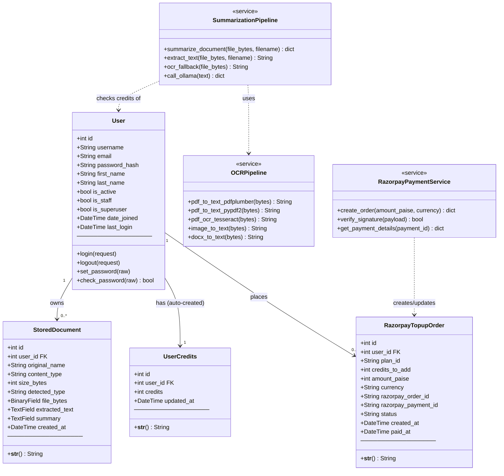
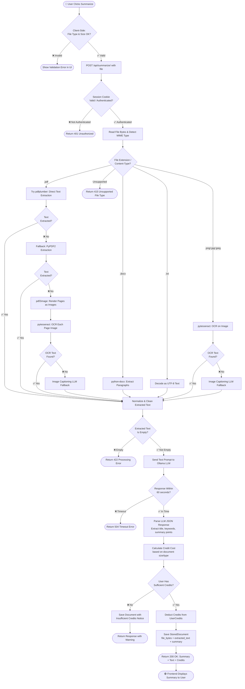
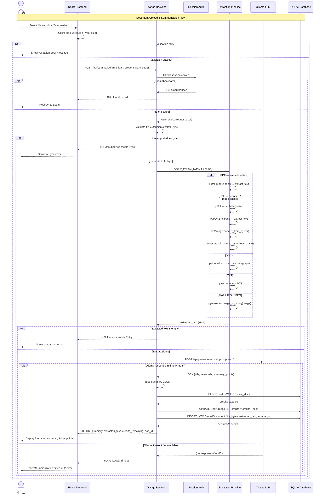
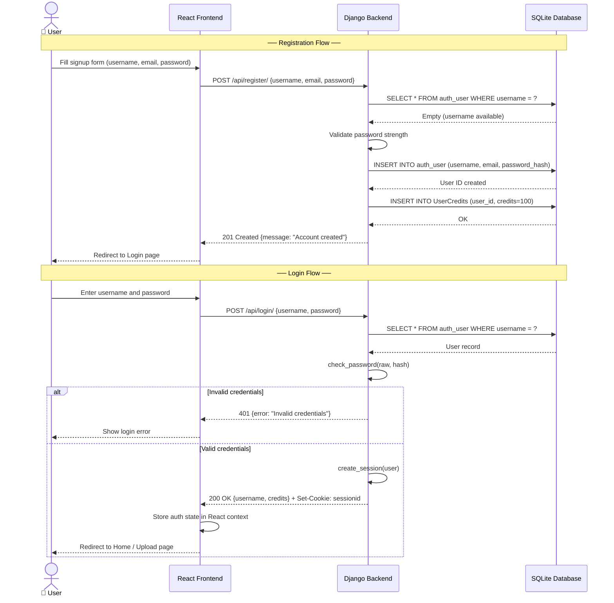
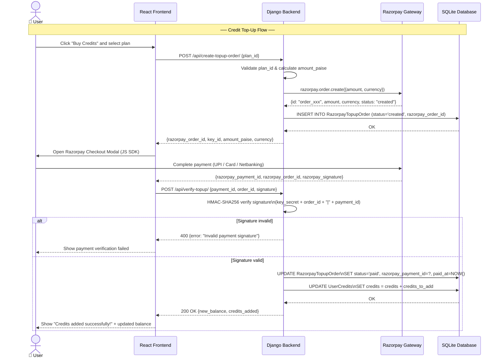

# UML Diagrams — AI-Powered Document Summarization System

This document contains all four UML diagrams for the project, drawn using Mermaid syntax.  
You can paste any diagram into [https://mermaid.live](https://mermaid.live) to preview and export as PNG/SVG for your report.

---

## 1. Use Case Diagram

**Actors:**
- **Guest User** — unauthenticated visitor
- **Registered User** — authenticated account holder
- **Admin** — Django superuser with backend portal access
- **Razorpay** — external payment gateway (system actor)

```mermaid
%%{init: {'theme': 'default', 'flowchart': {'curve': 'linear'}}}%%
flowchart TB
    subgraph Actors["ACTORS"]
        GU(["👤 Guest User"])
        RU(["👤 Registered User"])
        AD(["👤 Admin"])
        RP(["⚙️ Razorpay\nGateway"])
    end

    subgraph DSS["«System» Document Summarization System"]
        direction TB

        subgraph Auth["Authentication"]
            UC1["Register / Sign Up"]
            UC2["Login"]
            UC3["Logout"]
        end

        subgraph Core["Core Features"]
            UC4["Upload Document"]
            UC5["«uses» Extract Text\n(OCR / Direct)"]
            UC6["«uses» Generate Summary\n(Ollama LLM)"]
            UC7["View My Uploads"]
            UC8["Download / View Document"]
        end

        subgraph Account["Account Management"]
            UC9["Manage Profile"]
            UC10["Change Password"]
            UC11["View Security Settings"]
        end

        subgraph Billing["Credits & Billing"]
            UC12["Top-Up Credits"]
            UC13["«uses» Process Payment"]
            UC14["View Billing History"]
        end

        subgraph AdminUC["Administration"]
            UC15["Access Admin Portal"]
            UC16["Manage Users"]
            UC17["View All Documents"]
        end
    end

    GU --> UC1
    GU --> UC2

    RU --> UC2
    RU --> UC3
    RU --> UC4
    RU --> UC7
    RU --> UC8
    RU --> UC9
    RU --> UC10
    RU --> UC11
    RU --> UC12
    RU --> UC14

    AD --> UC2
    AD --> UC15
    AD --> UC16
    AD --> UC17

    UC4 -- "«include»" --> UC5
    UC4 -- "«include»" --> UC6
    UC12 -- "«include»" --> UC13
    UC13 -- "interacts" --> RP
```



---

## 2. Class Diagram

**Notes:**
- `User` is Django's built-in `AbstractUser` model.
- `UserCredits` is created automatically when a `User` is created (via `post_save` signal).
- All foreign keys and one-to-one links are shown with labelled relationships.



---

## 3. Activity Diagram

### 3a. Document Upload and Summarization Flow



---

### 3b. Credit Top-Up Payment Flow

```mermaid
flowchart TD
    Start([🔵 User Selects Credit Plan])
    --> PostOrder[POST /api/create-topup-order/\n{ plan_id }]
    PostOrder --> AuthCheck{Authenticated?}
    AuthCheck -- ❌ No --> Return401([Return 401])
    AuthCheck -- ✅ Yes --> ValidPlan{Valid Plan ID?}
    ValidPlan -- ❌ No --> Return400([Return 400 Bad Request])
    ValidPlan -- ✅ Yes --> CreateRzpOrder[Call Razorpay:\nCreate Order with amount_paise]
    CreateRzpOrder --> RzpOK{Razorpay\nResponds OK?}
    RzpOK -- ❌ No --> Return502([Return 502 Payment Gateway Error])
    RzpOK -- ✅ Yes --> SaveOrder[Save RazorpayTopupOrder\nstatus = 'created']
    SaveOrder --> ReturnOrderDetails[Return order_id, key_id, amount to Frontend]
    ReturnOrderDetails --> OpenModal[Open Razorpay Checkout Modal]
    OpenModal --> UserPays{User Completes\nPayment?}
    UserPays -- ❌ Cancelled --> ShowCancelled([Show Cancellation Message])
    UserPays -- ✅ Success --> VerifyPost[POST /api/verify-topup/\n{ payment_id, order_id, signature }]
    VerifyPost --> HMACVerify{HMAC Signature\nValid?}
    HMACVerify -- ❌ Invalid --> Return400Sig([Return 400 Invalid Signature])
    HMACVerify -- ✅ Valid --> UpdateOrder[Update RazorpayTopupOrder\nstatus = 'paid', paid_at = now()]
    UpdateOrder --> AddCredits[Add credits_to_add to UserCredits]
    AddCredits --> Return200([Return 200: New Credit Balance])
    Return200 --> UpdateUI([🟢 Update Credit Display in UI])
```

---

## 4. Sequence Diagram

### 4a. Document Upload and Summarization



---

### 4b. User Registration and Login



---

### 4c. Credit Top-Up Payment Sequence



---

## How to Export Diagrams as Images

### Option A — Mermaid Live Editor (Easiest)
1. Go to [https://mermaid.live](https://mermaid.live)
2. Paste any `mermaid` code block above (without the triple backticks)
3. Click **Download PNG** or **Download SVG**
4. Insert the image into your Word report

### Option B — VS Code (with extension)
Install the **Mermaid Preview** extension → open this file → click the preview icon next to any diagram → right-click → **Save image**

### Option C — Pandoc (renders inline in docx)
```powershell
& "C:\Users\HP\AppData\Local\Pandoc\pandoc.exe" .\docs\UML_DIAGRAMS.md -o .\docs\UML_DIAGRAMS.docx
```
> Note: Pandoc requires the `mermaid-filter` plugin to render diagrams automatically in DOCX. Without it, the raw Mermaid code will appear as code blocks in the Word file — use Option A/B for best quality images.
