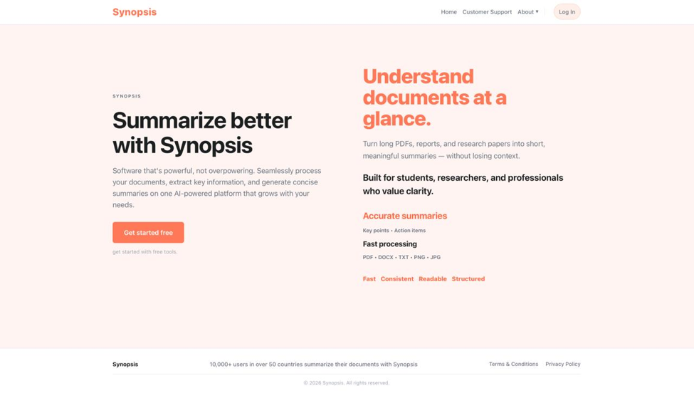
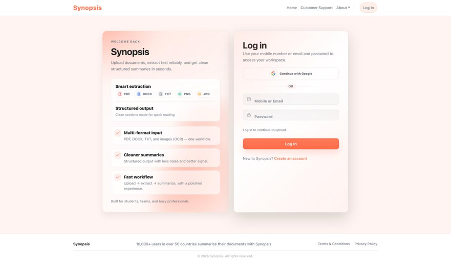
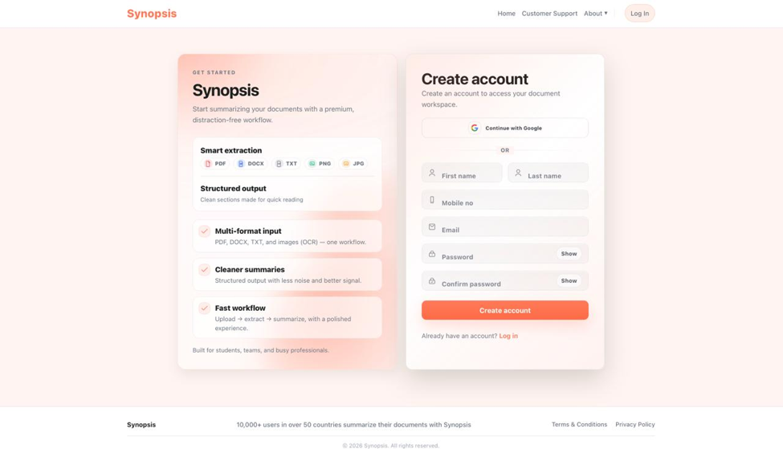
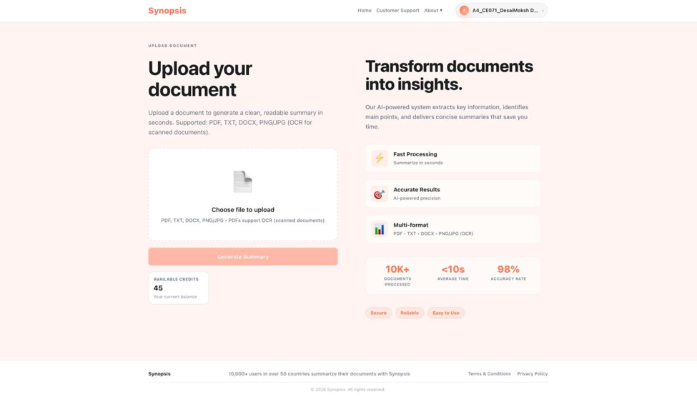
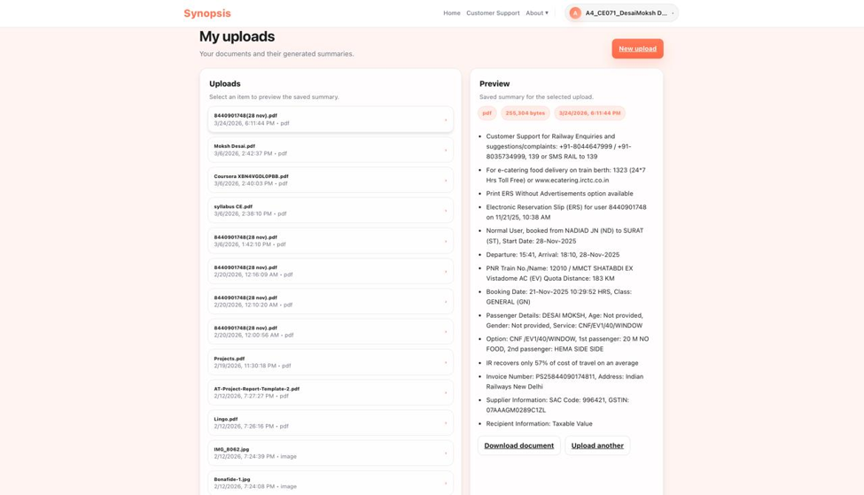
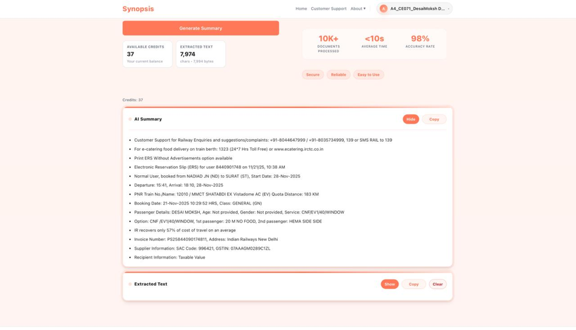
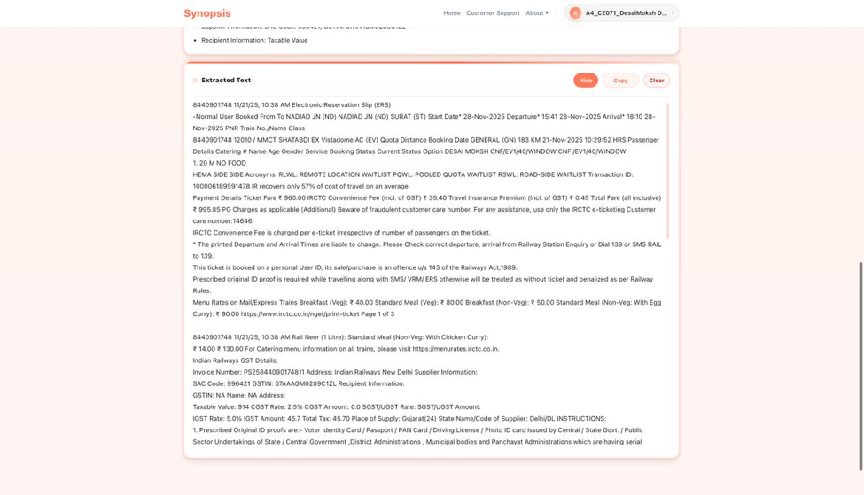
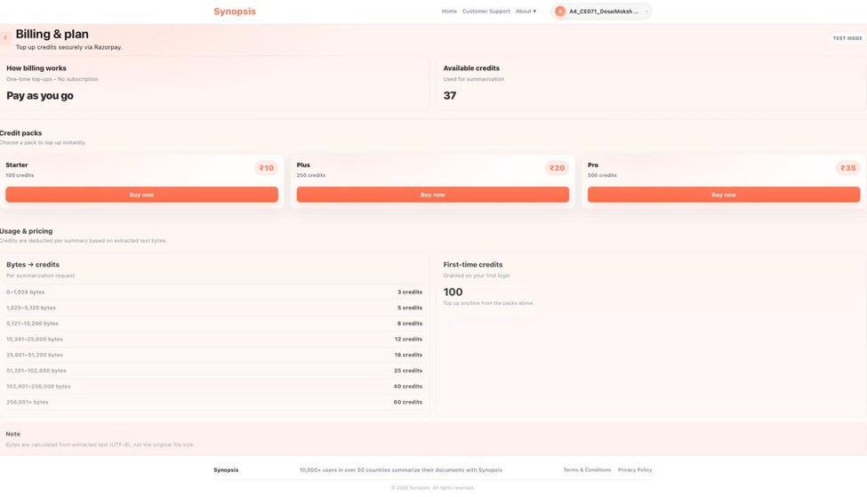
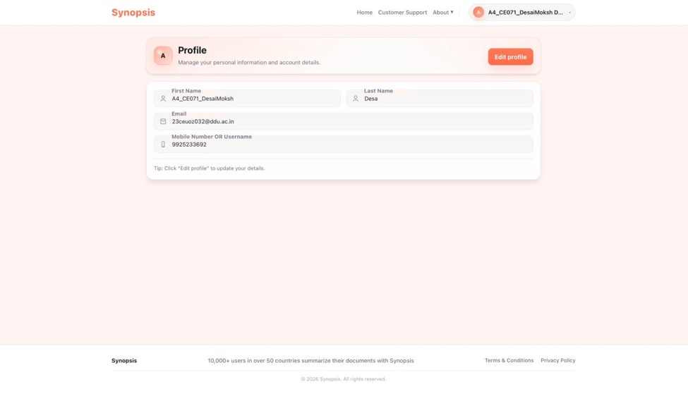
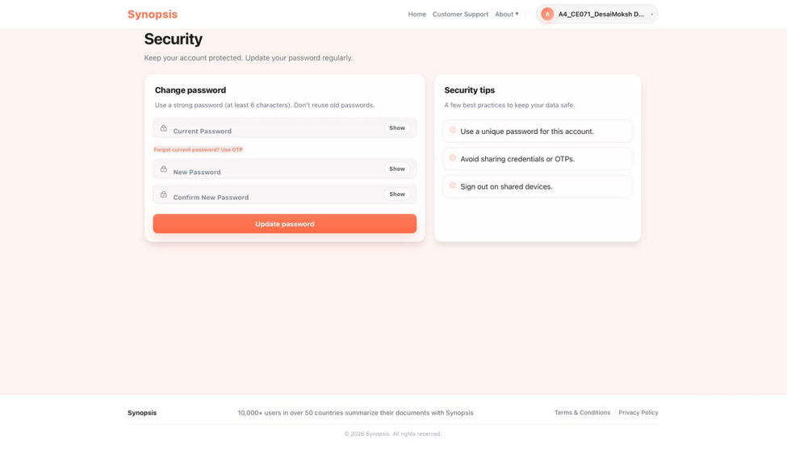

# 📄 Synopsis – AI-Powered Document Summarization System

An intelligent web application that generates concise summaries from documents using a **locally hosted Large Language Model (LLM)**. The system supports multiple document formats, OCR for scanned files, secure authentication, and a credit-based usage model.

---

## ✨ Features

- 📄 Supports PDF, DOCX, TXT, PNG, JPG and JPEG files
- 🤖 AI-powered document summarization using Ollama
- 🔍 OCR support for scanned documents using Tesseract OCR
- 🔐 Secure user authentication and authorization
- 📁 Document upload history
- 💳 Credit-based usage system
- 💰 Razorpay payment integration
- 👤 User profile management
- 🔒 Password management
- ⚡ Fast document processing
- 📊 Clean and structured summaries

## 🛠 Tech Stack

| Category | Technologies |
|----------|--------------|
| **Frontend** | React 19, JavaScript, Vite, CSS, React Router |
| **Backend** | Django, Python |
| **AI / NLP** | Ollama, Mistral LLM, Tesseract OCR |
| **Document Processing** | pdfplumber, PyPDF2, pdf2image, Pillow, python-docx |
| **Database** | SQLite |
| **Payment Gateway** | Razorpay |
| **Tools** | Git, GitHub, VS Code |

## ⚙️ Installation

### 1. Clone the Repository

```bash
git clone https://github.com/om-chauahan/document-summarization-system.git
```

### 2. Navigate to the Project

```bash
cd document-summarization-system/Document_summarization_system
```

### 3. Create a Virtual Environment

```bash
python -m venv .venv
```

### 4. Activate the Virtual Environment

**Windows**

```bash
.venv\Scripts\activate
```

**Linux / macOS**

```bash
source .venv/bin/activate
```

### 5. Install Python Dependencies

```bash
pip install -r requirements.txt
```

### 6. Configure Environment Variables

Create a `.env` file in the project root and add the required environment variables (for example, your Razorpay keys and other project-specific settings).

### 7. Apply Database Migrations

```bash
python manage.py migrate
```

### 8. Start the Django Backend

```bash
python manage.py runserver
```

### 9. Start the React Frontend

Open a new terminal:

```bash
cd frontend
npm install
npm run dev
```

### 10. Start Ollama

In another terminal:

```bash
ollama serve
```

If the Mistral model is not already installed:

```bash
ollama pull mistral
```

Run the model:

```bash
ollama run mistral
```


## 📂 Project Structure

```text
document-summarization-system/
│
├── Document_summarization_system/
│   ├── frontend/                  # React Frontend
│   ├── DSS_app/                   # Django Application
│   ├── Document_summarization_system/ # Django Project Configuration
│   ├── docs/                      # Project Documentation
│   ├── manage.py
│   ├── requirements.txt
│   ├── README.md
│   └── .env.example
│
├── .gitignore
└── README.md
```

## 🔄 Project Workflow

```text
                     +----------------+
                     |     User       |
                     +-------+--------+
                             |
                             ▼
                 +----------------------+
                 | Upload Document      |
                 +----------+-----------+
                            |
                            ▼
                 +----------------------+
                 | Detect File Type     |
                 +----------+-----------+
                            |
              +-------------+-------------+
              |                           |
              ▼                           ▼
     Digital Document            Scanned Document
              |                           |
              ▼                           ▼
      Extract Text                 OCR (Tesseract)
              \___________________________/
                          |
                          ▼
               Clean & Process Text
                          |
                          ▼
                 Ollama (Mistral LLM)
                          |
                          ▼
                 Generate Summary
                          |
                          ▼
              Store Summary (SQLite)
                          |
                          ▼
               Display to the User
```

## 🌟 Project Highlights

- 🧠 Uses a **local Mistral LLM** through Ollama for AI-powered summarization.
- 📄 Supports both **digital and scanned documents**.
- 🔍 Performs OCR using **Tesseract** for image-based PDFs.
- 💳 Includes a **credit-based usage system** with Razorpay integration.
- 🔐 Secure authentication and user profile management.
- ⚡ Generates fast and structured summaries.
- 📚 Maintains upload history for users.
- 💻 Runs completely on a local environment without requiring cloud LLM APIs.

  ## 📸 Screenshots

### 🏠 Home Page



---

### 🔑 Login Page



---

### 📝 Sign Up



---

### 📤 Upload Document



---

### 📄 My Uploads



---

### 📝 Summary Output



---

### 🔍 Extracted Text



---

### 💳 Billing



---

### 👤 Profile



---

### 🔒 Security Settings



## 🚀 Future Enhancements

- PostgreSQL support
- Cloud deployment
- Multi-language summarization
- Export summaries to PDF and DOCX
- AI-powered keyword extraction
- Speech-to-text document summarization
- Multiple LLM support (Llama, Gemma, DeepSeek)
- Collaborative workspace
- Admin analytics dashboard

## 👨‍💻 Author

**Om Chauhan**

B.Tech Computer Engineering

Dharmsinh Desai University

GitHub: https://github.com/om-chauahan

## 📜 License

This project was developed for educational purposes as part of the System Design Practice course at Dharmsinh Desai University.
